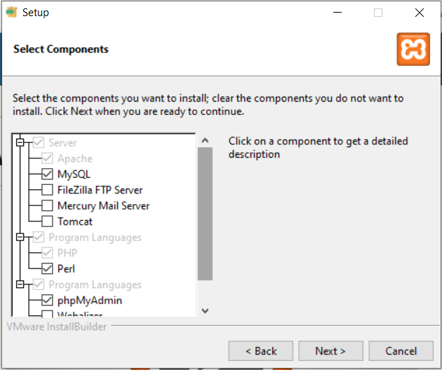

# PHP (Hypertext Preprocessor)
O PHP é:
- uma linguagem backend
- realiza conexão com banco de dados
- processado no servidor
- executa o processamento no servidor e devolve para o cliente apenas a resposta.
- Exemplo: 
    - Arquivo PHP: 2+2
    - Resposta para o cliente: 4
- todo arquivo PHP terá a extensão `.php`

## Aula 01
- Introdução ao PHP
- Infraestrutura necessária
- Onde colocar os nossos arquivos
- Variável
- Escrita na tela

## Introdução ao PHP
- Documentação https://www.php.net/manual/pt_BR/
- Na web ele brilha, de todos os sites que existem, 77% é PHP https://benjamincrozat.com/php-is-dead
- Com PHP você pode criar projetos
    - Web
    - IoT
    - Desktop
    - Linha de comando
- PHP é uma linguagem interpretada

## Infraestrutura
- Servidor XAMPP (https://www.apachefriends.org/)
- Nossos site ficam em servidores web, um servidor web é responsável por exibir/servir páginas WEB.

## Onde colocar os nossos arquivos
- Os arquivos PHP precisam ser executados à partir do servidor, como se você estivesse acessando pela internet.
- Para o XAMPP, o local aonde devemos colocar os arquivos é `c:\xampp\htdocs`. Exemplo: `c:\xampp\htdocs\loja\index.php`.
- Para executar arquivos PHP, precisamos requisitá-los à partir do navegador digitando `http://localhost`. Exemplo: `http://localhost/loja/index.php`
